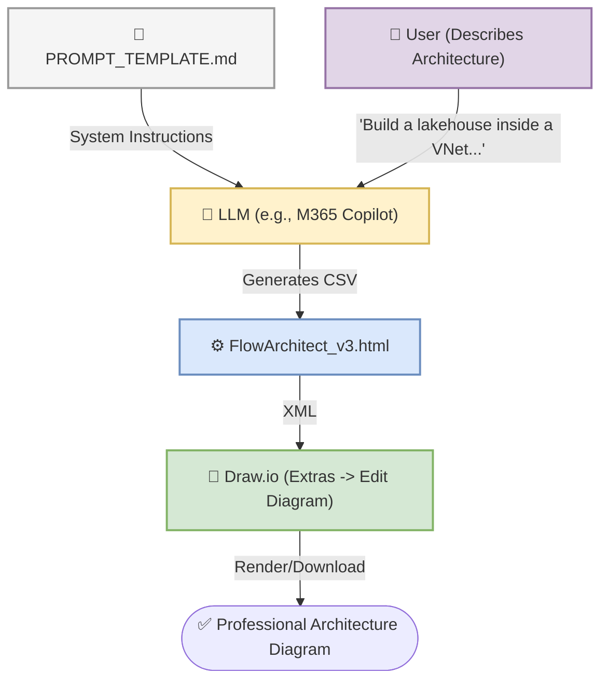

# FlowArchitect

> LLM-generated CSV → Professional Draw.io Architecture Diagrams
> 
> Zero backend. Single HTML file. Portable XML output.

## What It Does

FlowArchitect takes structured CSV data (generated by any LLM) and converts it into a complete, professionally-styled Draw.io architecture diagram. The diagrams include:

- **Official Azure/Databricks icons** (Data Factory, Databricks, Cosmos DB, Synapse, etc.)
- **Medallion layer styling** (Bronze=yellow, Silver=purple, Gold=green)
- **Topological left-to-right layout** with phase column headers
- **Orthogonal edge routing** with optional green step-number badges
- **Full mxGraph XML** ready for import into any Draw.io instance

## Quick Start

### Option 1: Portable Single File (Recommended)
1. Open `FlowArchitect_v3.html` in any browser — no server needed
2. Paste your CSV in the left pane
3. Click **Render Diagram** to preview it, or
4. Click **📋 Copy XML** → paste into Draw.io's **Extras > Edit Diagram**
5. Or click **💾 Download .drawio** → open directly in Draw.io desktop/web

### Option 2: Development Server
```bash
cd drawio-translate
python3 -m http.server 8080
# Open http://localhost:8080
```

## Workflow: Using any LLM (e.g., M365 Copilot, Gemini, ChatGPT)



1. Copy `PROMPT_TEMPLATE.md` into your LLM of choice (e.g., M365 Copilot).
2. Describe your architecture in plain English.
3. Paste the LLM's CSV output into `FlowArchitect_v3.html`.
4. Render it inside the browser, or click **Copy XML** / **Download .drawio**.
5. Import the XML into Draw.io via **Extras -> Edit Diagram**, or open the `.drawio` file directly. Minor spacing adjustments and you're done!

## CSV Schema

| Column | Description |
|---|---|
| `id` | Unique numeric ID |
| `name` | Node display label |
| `parent` | Phase ID (for column placement) or blank |
| `type` | Component type from the palette |
| `receives_from` | Source ID(s), semicolon-separated |
| `step_number` | Optional step badge number |

## Available Component Types

### Azure Services (Official Icons)
`adf` · `databricks` · `event_hubs` · `kafka` · `cosmos_db` · `azure_sql` · `synapse` · `stream_analytics` · `adls` · `storage_account` · `powerbi` · `purview` · `data_catalog` · `key_vault` · `active_directory` · `azure_monitor` · `web_app`

### Boundaries (Hierarchical Nesting)
`boundary_vnet` · `boundary_subnet` · `boundary_rg` · `boundary_generic`

### Styled Boxes
`bronze_layer` · `silver_layer` · `gold_layer` · `data_source` · `consumer` · `tool`

### Layout
`phase` — defines column headers (Ingest, Transform, Serve, etc.)

## Project Structure

```
drawio-translate/
├── FlowArchitect_v3.html # Portable single-file (share this!)
├── PROMPT_TEMPLATE.md    # LLM system prompt
├── index.html            # Dev version (references css/js)
├── css/style.css         # Styles
├── js/app.js             # XML generation engine
├── test_xml.js           # Node.js test script
└── README.md
```

## Tech Stack

- Vanilla HTML/CSS/JS — zero dependencies
- mxGraph XML generation with explicit coordinate layout
- Draw.io embed API (optional preview) + clipboard/download output
- Azure icon SVGs from the official Draw.io stencil library

## Build Log

| Date | Action | Summary |
|---|---|---|
| 2026-04-14 | Initial | CSV → Draw.io via embed API `descriptor` format |
| 2026-04-14 | Rewrite | Switched to raw XML generation with precise coordinates |
| 2026-04-14 | Stencils | Added ADF, Synapse, Purview, Stream Analytics, layer boxes |
| 2026-04-14 | Portability | Copy XML, Download .drawio, single-file HTML, PROMPT_TEMPLATE |
| 2026-04-15 | Version 3 | Added boundaries/nesting, Azure app stencils, FlowArchitect_v3.html |
