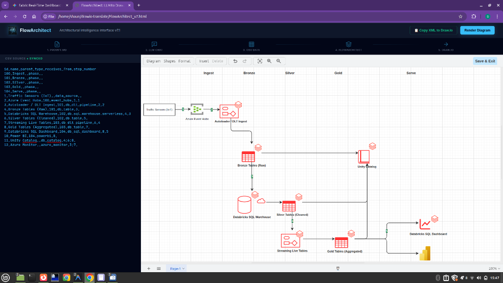
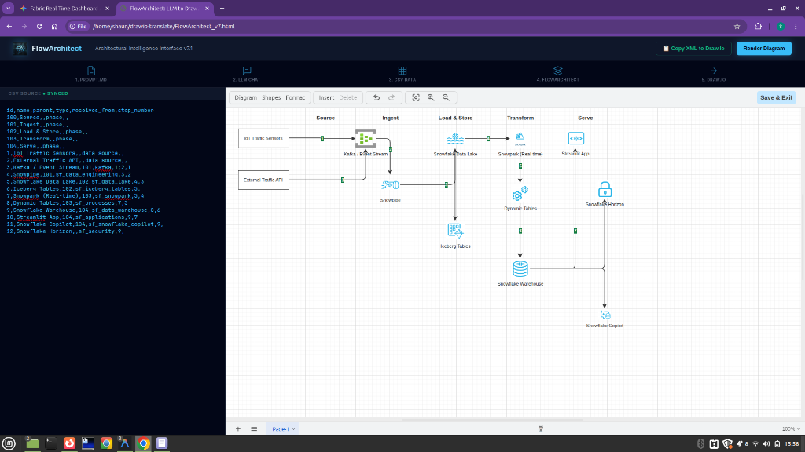
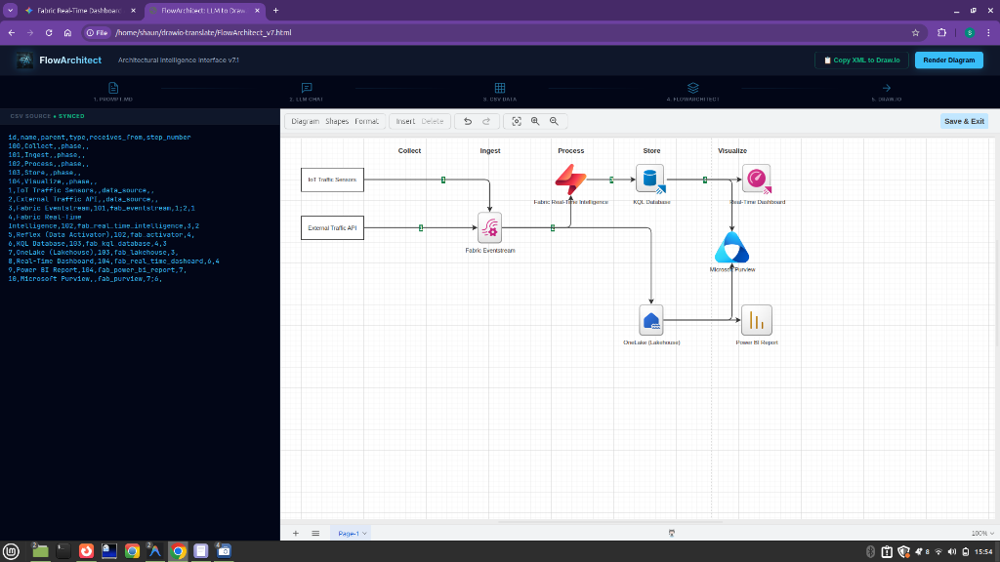
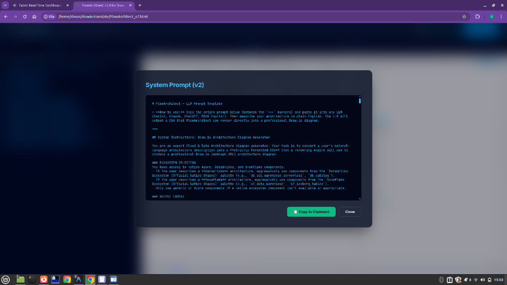
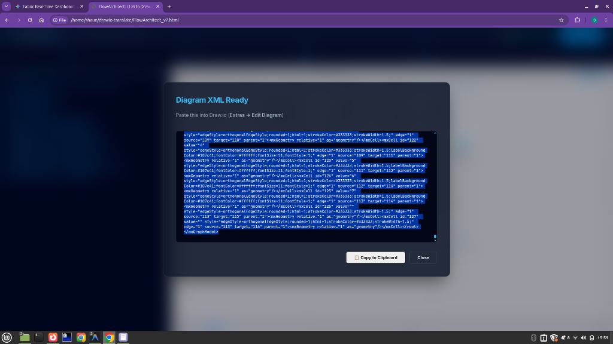
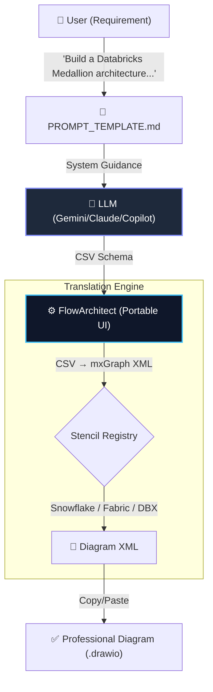

# FlowArchitect 

> **Conceptualized by [Jericho2010](https://github.com/Jericho2010)**
>
> **LLM-generated CSV → Cinematic Architecture Diagrams**
>
> *Elite Obsidian-style interface with native multi-cloud stencil support.*

---

---

## 🎨 Professional Showcase

| **Databricks Medallion Ecosystem** | **Snowflake Data Cloud Ecosystem** |
| :---: | :---: |
|  |  |
| *Automated rendering of DLT pipelines, Serverless Warehouses, and Unity Catalog.* | *High-fidelity mapping of Snowpark, Dynamic Tables, and Horizon Governance.* |

| **Microsoft Fabric & Real-Time Intelligence** | **System Prompt (v2) Interface** |
| :---: | :---: |
|  |  |
| *Native support for KQL Databases, OneLake, and Fabric Eventstreams.* | *One-click access to the latest elite LLM system instructions.* |

| **Diagram XML Export Engine** |
| :---: |
|  |
| *Instant mxGraph XML generation for seamless Draw.io integration.* |

---

## 🚀 The Core Workflow

FlowArchitect transforms technical requirements into professional-grade visual documentation via a precise translation layer.



---

## 🏛️ Evolution of FlowArchitect

### **Phase 1: The Initial Spark (Databricks Medallion)**
FlowArchitect was born from the need to break technical stasis when visualizing complex **Databricks Lakehouse** architectures. v1–v2 focused on the automated placement of Medallion (Bronze, Silver, Gold) clusters within secure VNet boundaries, eliminating the manual overhead for data engineers.

### **Phase 2: The Multi-Cloud Horizon (Snowflake Ecosystem)**
As data ecosystems converged, v3–v5 introduced deep integration for the **Snowflake Data Cloud**. This expansion allowed architects to render governed warehouses, Snowpipes, and private links with the same precision as cloud-native resources.

### **Phase 3: The Cinematic Pinnacle (Microsoft Fabric & Obsidian Slate)**
With v6–v7, FlowArchitect achieved its current state-of-the-art interface. By integrating the **Microsoft Fabric** official icon pack and adopting the **Obsidian Slate** glassmorphism aesthetic, it transformed from a utility script into a premium "God Mode" drafting suite.

---

## 📜 Credits & Resource Registry

FlowArchitect is built on the collective intelligence of the architectural community. We explicitly credit and utilize assets from the following sources:

### **Databricks**
*   **Official**: [Databricks High-Level Architecture Documentation](https://docs.databricks.com/en/introduction/high-level-architecture.html).
*   **Community Stencils**: [nihil0/databricks-drawio-icons](https://github.com/nihil0/databricks-drawio-icons) - Essential Draw.io icon library.

### **Snowflake**
*   **Official**: [Snowflake Brand Assets Library](https://www.snowflake.com/brand-assets/).
*   **Community Stencils**: [SELECT - Snowflake Drawio Stencils](https://github.com/get-select/snowflake-drawio-stencils) - The definitive Snowflake diagramming pack.

### **Microsoft Fabric**
*   **Official**: [Microsoft Fabric Product & Experience Icons](https://learn.microsoft.com/en-us/fabric/get-started/icons).
*   **Community Guide**: [Data Guideline - Fabric Icons for Solution Architects](https://dataguideline.com/a-complete-set-of-microsoft-fabric-icons-for-solution-architects/).
*   **Community Stencils**: [astrzala/FabricToolset](https://github.com/astrzala/FabricToolset) & [marclelijveld/Fabric-Icons](https://github.com/marclelijveld/Fabric-Icons).

### **Tooling**
*   **Engine**: Built for [diagrams.net (Draw.io)](https://app.diagrams.net).
*   **UI Foundation**: [Lucide Icons](https://lucide.dev) & [Inter Font Family](https://rsms.me/inter/).

---

## 🛠️ Build & Installation

To generate the portable release:

```bash
# Inlines CSS, JS, and Prompts into a single file
node scripts/build.js
```

The resulting **`FlowArchitect_v7.html`** is a standalone, browser-optimized application.

---

**© 2026 FlowArchitect Engineering.**
*"Draw at the speed of thought."*
